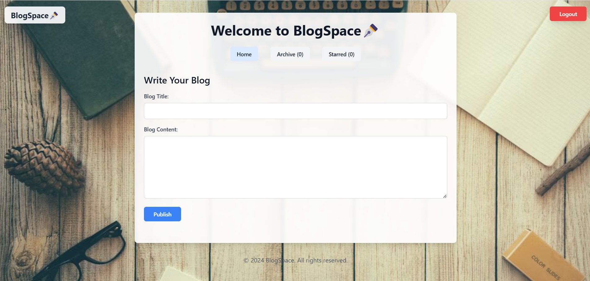

## Demo Video
[](https://youtu.be/Qnf-2ye-4OQ)

<p align="center">
    
</p>

<h1 align="center">
  BlogSpace - Your Own Blogging Space
</h1>


# BlogSpace
A full-stack blog application built with React and Node.js that enables users to create, manage, and organize their blog posts with features like user authentication, post starring, and archives.

## 🚀 Features

- **User Authentication**
  - Secure registration and login system
  - JWT-based authentication with HTTP-only cookies
  - Protected routes and user sessions

- **Blog Management**
  - Create and edit blog posts with rich text content
  - Star/unstar posts for quick access
  - Chronological post organization
  - Real-time updates using Redux

- **User Experience**
  - Responsive design with Tailwind CSS
  - Toast notifications for user actions
  - Form validation with Formik & Yup
  - Intuitive navigation with React Router

## 🛠️ Tech Stack

### Frontend
- React.js (Vite)
- Redux Toolkit for state management
- React Router for navigation
- Formik & Yup for form handling
- Tailwind CSS for styling
- Axios for HTTP requests
- React-Toastify for notifications

### Backend
- Node.js with Express.js
- MongoDB with Mongoose
- JWT for authentication
- Cookie-based sessions
- CORS enabled

### Installation

1. Clone the repository
```bash
git clone https://github.com/yourusername/blog-app.git
cd blog-app

2.Install backend dependencies
```bash
cd server
npm install

3. Install frontend dependencies
```bash
cd client
npm install

4. Start the development servers
```bash
# Terminal 1: Start backend server
cd server
npm run dev

# Terminal 2: Start frontend server
cd client
npm run dev

###🔒 Security Features

Password hashing with bcrypt
JWT-based authentication
HTTP-only cookies
Protected routes
CORS configuration
Input validation
Comprehensive error handling

###🧪 Running Tests

Register a new user
Login with credentials
Create and manage blog posts
Test star/unstar functionality
Verify post deletion
Check authentication persistence
Test protected routes
